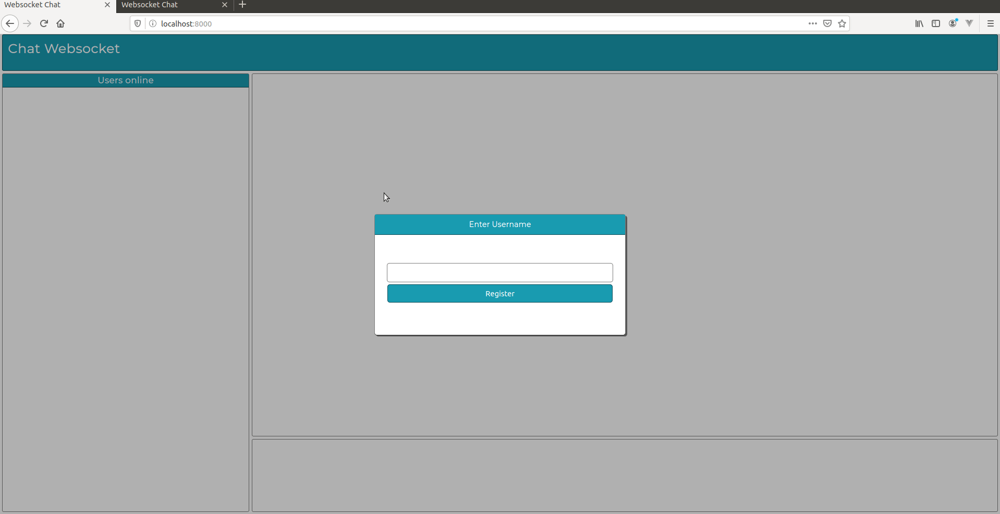

# Websocket Chat

Chat simples utilizando websocket para a comunicação entre clients

## Libs

* cboden/ratchet
* jfgromano/websocket-router

## Getting Started

Para rodar o projeto basta subir o servidor http com:

```
php -S localhost:8000 -t public
```

E rodar o websocket:

```
php websocket.php
```

